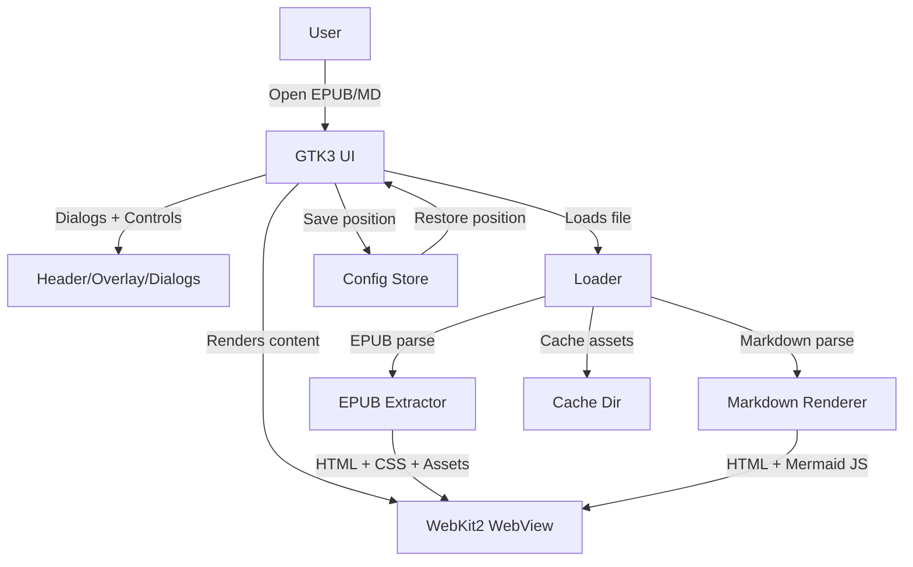
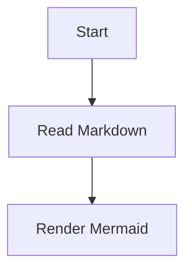

# Jaraco Reader

Jaraco Reader is a simple EPUB reader for postmarketOS built with GTK and WebKit2GTK. It renders full HTML/CSS (including images), supports adjustable font size (zoom), page navigation, edge arrows, and restores your last reading position.

## Features

- Full HTML/CSS rendering via WebKit2GTK (images supported).
- Markdown files rendered to HTML, with Mermaid diagrams.
- Adjustable font size (zoom in/out).
- Page navigation with edge arrows and “Go to page” dialog.
- Reading position and font size saved per book.
- Recent books list (up to 5) on startup when no book is open.
- Tap/click empty screen to open the book selector.
- Works in portrait and landscape.

## Architecture Diagram



## Requirements

Runtime dependencies (Alpine/postmarketOS):

- `python3`
- `py3-gobject3`
- `py3-markdown`
- `gtk+3.0`
- `webkit2gtk-4.1`
- `adwaita-icon-theme` (for icons)

Build dependencies:

- `abuild`
- `alpine-sdk`

## Build On Device (postmarketOS / Alpine)

Install dependencies:

```bash
apk add abuild alpine-sdk python3 py3-gobject3 py3-markdown gtk+3.0 webkit2gtk-4.1 adwaita-icon-theme
```

Build APK:

```bash
abuild -F
```

After build completes, the APK is written to:

`/home/user/packages/projects/aarch64/`

## Install

Install the latest APK:

```bash
apk add --allow-untrusted /home/user/packages/projects/aarch64/jaraco-reader-0.1.0-r7.apk
```

Replace the filename if your build produced a different `-rX` revision.

## Run From Source

```bash
./app/jaraco-reader /path/to/book.epub
```

If launched without a file, the app shows a recent list (max 5) and a Browse button. It supports `.epub`, `.md`, and `.markdown`.

You can also open Markdown files directly:

```bash
./app/jaraco-reader /path/to/notes.md
```

## Markdown And Mermaid Support

Jaraco Reader can render Markdown files to HTML inside the embedded WebKit view.
This makes it useful for technical notes, documentation, and diagrams in addition
to EPUB books.

Supported Markdown features include:

- Headings, paragraphs, and lists
- Fenced code blocks
- Tables
- Table of contents generation
- Mermaid code blocks rendered as diagrams

Use Mermaid in Markdown like this:

````markdown
# Example


````

Markdown Mermaid diagrams are rendered offline via a bundled `mermaid.min.js`.

To enable full Mermaid rendering, replace `data/mermaid.min.js` with the official
minified Mermaid build before building. You can download it with:

```bash
curl -L -o data/mermaid.min.js \
  "https://cdn.jsdelivr.net/npm/mermaid@10/dist/mermaid.min.js"
```

Markdown rendering requires the `py3-markdown` package (included in the APK dependencies).

## Data Storage

- Reading position and font size are stored in:
  `~/.config/jaraco-reader/positions.json`
- Extracted EPUB content cache:
  `~/.cache/jaraco-reader/`

## Packaging Notes

The APK package is defined in `APKBUILD`. The app is installed to:

- `/usr/bin/jaraco-reader`
- `/usr/share/applications/io.jaraco.Reader.desktop`
- `/usr/share/metainfo/io.jaraco.Reader.appdata.xml`
- `/usr/share/icons/hicolor/scalable/apps/io.jaraco.Reader.svg`

## Troubleshooting

### GTK version conflicts

If you see:

`Requiring namespace 'Gtk' version '3.0', but '4.0' is already loaded`

That means a GTK4 component was loaded first. This app targets GTK3 because
`WebKit2-4.1` on this device depends on `Gtk-3.0`. Ensure only GTK3 is
required at runtime for this app.

### WebKit2GTK missing

If WebKit2GTK is missing, install:

```bash
apk add webkit2gtk-4.1
```

## License

MIT. See `LICENSE`.
